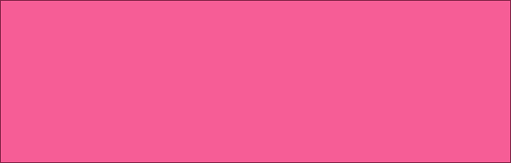
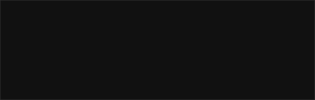
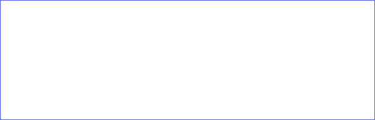

# jQuery Parallax

jQuery parallax scrolling library with an image preloader.

[](https://www.paypal.me/DjordjeJocic)

**Song of the project:** [Joe Satriani - Surfing with the Alien](https://www.youtube.com/watch?v=d_0khAAItqg)

## Versioning Scheme

I use a 3-digit [Semantic Versioning](https://semver.org/spec/v2.0.0.html) identifier, for example 1.0.2. These digits have the following meaning:

*   The first digit (1) specifies the MAJOR version number.
*   The second digit (0) specifies the MINOR version number.
*   The third digit (2) specifies the PATCH version number.

Complete documentation can be found by following the link above.

## Examples

This should be obvious, but before using the library you have to upload the following files from the "dist" directory to your server and add them to your project.

```html
<link href="src/css/parallax.css" rel="stylesheet" type="text/css" />
<script src="src/js/parallax.js" type="text/javascript"></script>
```

Be sure to check out the demo if you are confused.

### Example 1 - Without Parameters

CSS

```css
#my-parallax {
    background: #111 url(../img/1.jpg) no-repeat 0px 0px;
    background-size: 100% auto;
}
```

HTML

```html
<div id="my-parallax" class="parallax parallax-dark"></div>
```

JS

```js
$("#my-parallax").parallax();
```

### Example 2 - With Parameters

HTML

```html
<div id="my-parallax" class="parallax parallax-dark"></div>
```

JS

```js
$("#my-parallax").parallax({
    image  : "./demo/img/1.jpg",
    height : "400",
    scroll : "default"
});
```

### Example 3 - With Parameters & Manual Scroll

HTML

```html
<div id="my-parallax" class="parallax parallax-dark"></div>
```

JS - Setup

```js
$("#my-parallax").parallax({
    image  : "./demo/img/1.jpg",
    height : "400",
    scroll : "manual"
});
```

JS - Manual Scroll

```js
$("#my-parallax").parallaxScroll(scrollPosition);
```

## Themes

Three themes exist:

* .parallax-default - main color: #f65d96

Default Theme Example:

```html
<div id="example" class="parallax parallax-default"></div>
```



* .parallax-dark - main color: #111111

Dark Theme Example:

```html
<div id="example" class="parallax parallax-dark"></div>
```



* .parallax-light - main color: #ffffff

Light Theme Example:

```html
<div id="example" class="parallax parallax-light"></div>
```



## Settings

Default library settings are as follow.

```js
var settings = {
    image  : "",
    height : "400",
    scroll : "default"
};
```

Allowed parameters are as follow:

* image - String containing image location
* height - Number representing required height of the parallax window.
* scroll - String with value *default* for regular scroller or *manual* for custom scroller

## Support

Please don't hesitate to contact me if you have any questions, ideas, or concerns.

My Twitter account is: [@jocic_91](https://www.twitter.com/jocic_91)

My support E-Mail address is: [support@djordjejocic.com](mailto:support@djordjejocic.com)

## Copyright & License

Copyright (C) 2016 Đorđe Jocić

Licensed under the MIT license.
