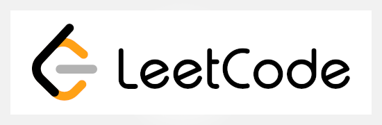
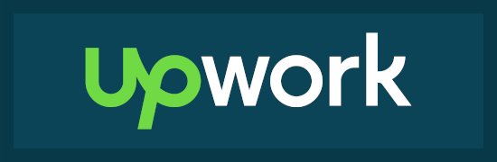
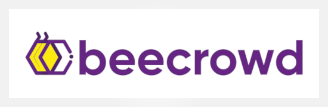
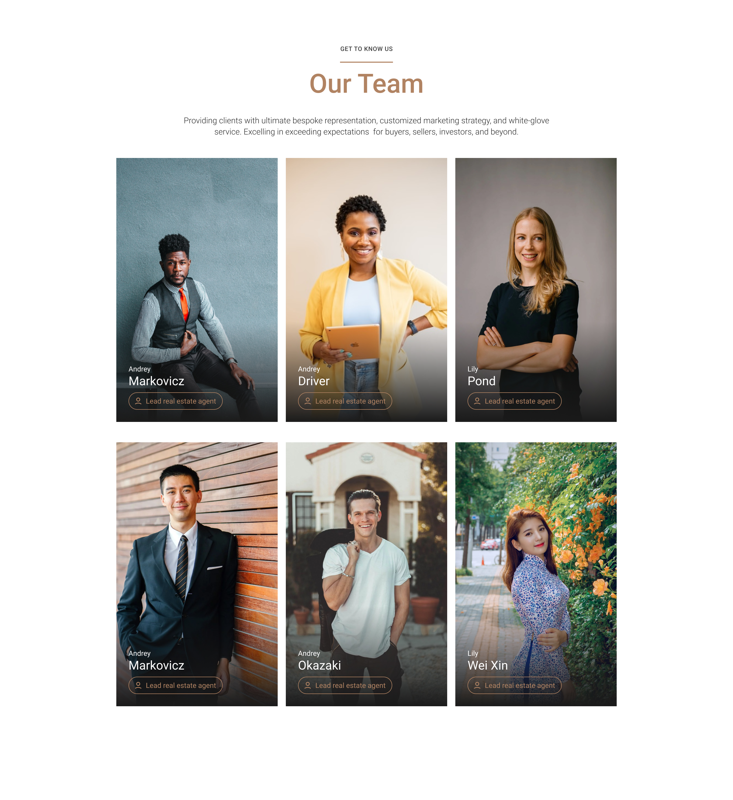

   

|DSA Platforms|Freelancing Platforms|
|---|---|
|||
||

## References (Web Development)

### October CMS Websites

Here are some websites I did in OctoberCMS.

<table>
  <tr>
    <td></td>
    <td></td>
  </tr>
  <tr>
    <td></td>
    <td></td>
  </tr>
  <tr>
    <td></td>
    <td></td>
  </tr>
</table>

### FIGMA Conversion (Corporate Team Portfolio)

This project was part of the vetting process for a Frontend Development position on UpWork, and it involved conversion of the provided FIGMA Design to a responsive HTML/CSS Template.

**Links:** [FIGMA Design](projects/showcase/2023/figma-conversion-1/figma-design.jpg) | [Desktop View](projects/showcase/2023/figma-conversion-1/figma-desktop.jpg) | [Mobile View](projects/showcase/2023/figma-conversion-1/figma-mobile.jpg) | [Source Code](projects/showcase/2023/figma-conversion-1/src) | [Live Demo](https://djordjejocic.com/showcase/figma-1/index.html)

